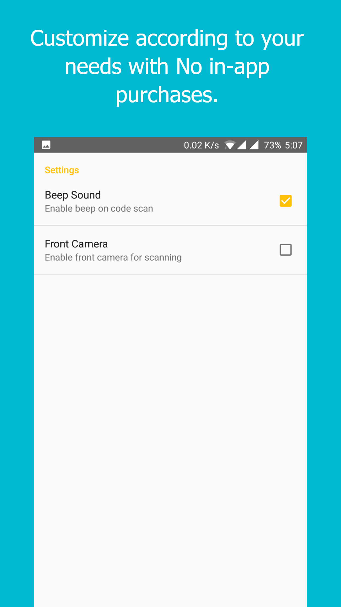
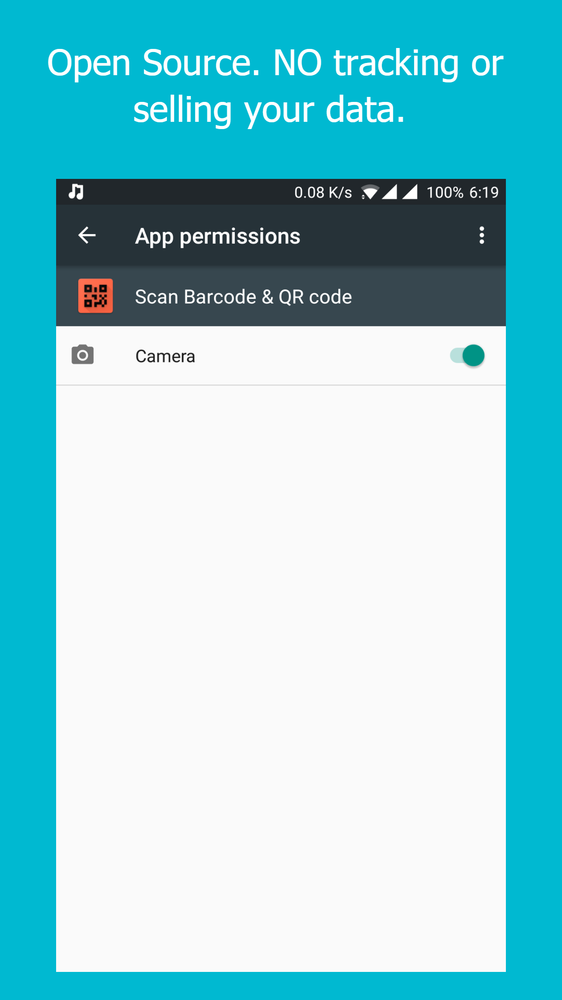

# ScanBarcode-QRcode
Scan Barcode &amp; QR code is a simple and fast code scanner with all the features a modern android app.

          

I completed the Udacity andriod course and decided to make my own app.

Reasons to make the Scanner app :
* The idea did not looked complex for a beginner to implement.
* I already knew a barcode scanner library which was pretty popular.
* All the similar apps on playstore had AD'S and I wanted a AD free version.
* The UI of these apps was also old, not updated for a time now so a Material Design solution was needed.

The libraries or resources used:
* [Zxing-android-embedded](https://github.com/journeyapps/zxing-android-embedded): really easy to use and does what it says very efficently.
* [cupboard](https://bitbucket.org/littlerobots/cupboard): makes SQL vey simple. you should atleast read it usage. [Read this for more info](http://guides.codepath.com/android/Easier-SQL-with-Cupboard)
* [CodePath Android Cliffnotes](http://guides.codepath.com/android): A crowdsourced resource for complete and up-to-date practical Android developer guides for any topic.
* youtube also helped as always.

Things I learned and implemented:
* RecyclerView with swipe actions.
* Database connectivity using SQLite.
* SharedPreferences.
* Intents.
* Countless hours of debugging and wow moments.

the app is available at https://github.com/shubhamnishad97/ScanBarcode-QRcode/raw/master/app/build/outputs/apk/app-debug.apk

tested to be working on 
* Oneplus 3T[API 25]
* Pixel[API 25]
* LG G3[API 19]
* Nexus 4[API 19]
* Nexus 5[API 23]
* Moto E[API 19]
* Redmi 4[API 25].
 
